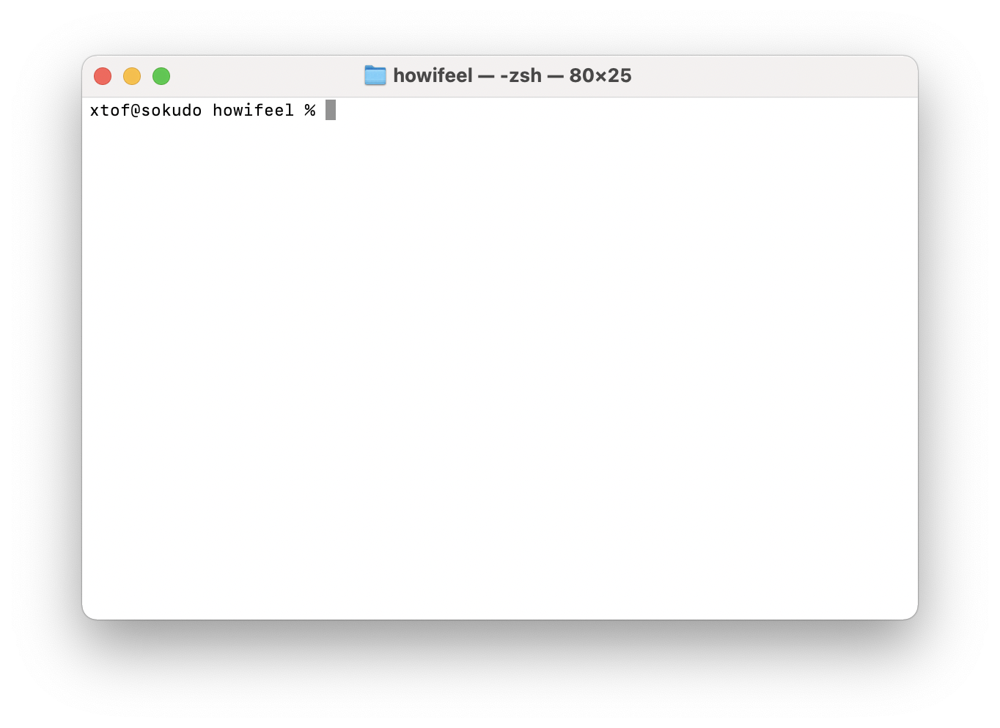
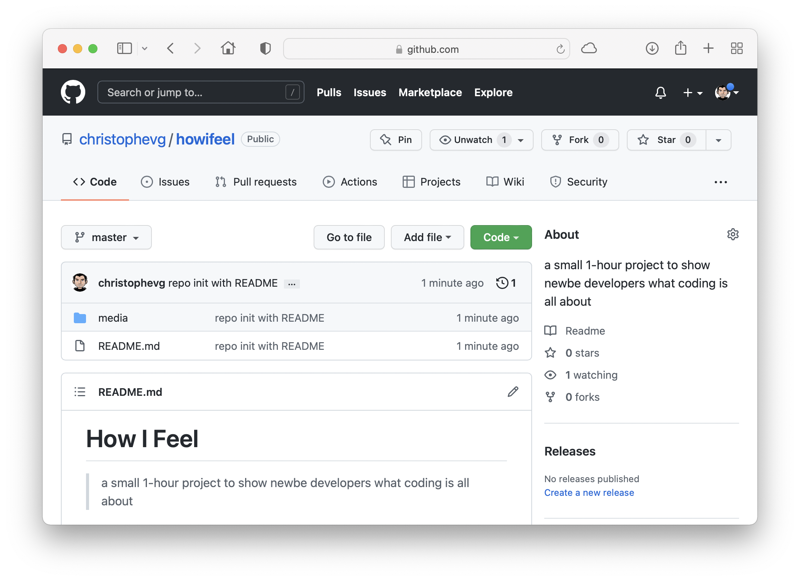

# How I Feel

> a small 1-hour project to show newbe developers what coding is all about

## Rationale

Starting in today's world of development of software can be daunting. Especially because the beginnings are so far apart from what we've come acustomed to when using that same software. Starting with "hello world" seems so utterly uninteresting that it takes a big effort to get past those first few days, before one reaches the level that something semi-useful can be created.

This repository is an experiment to start from a completely blanc directory and end up with an actual, useable piece of software. Each commit is a step in this experiment, described in the paragraphs below. The goal is _not_ to learn every step by heart, but to go through the entire process of conceiving and actually implementing a small real-world application. A way to get a realistic overview of what lies at the end of that first long stretch of new knowledge.

## Prerequisites

The following tools are needed and might first need some installation or creation of an account.

* A unix-like environment, say MacOS, Linux,... Why? Because that's what I use. You migth get away with Windows. I won't be here to help, sorry :-( A unix-like environment comes with a terminal, which allows you to give commands to the system. On MacOS, the Terminal application looks like this: 
* An editor, something to write code with. Here personal flavour kicks in. I like (TextMate)[https://macromates.com], you might like something else. Please, don't hurt yourself, don't like [notepad](https://en.wikipedia.org/wiki/Windows_Notepad).
* (git)[https://git-scm.com/book/en/v2/Getting-Started-Installing-Git)
* A [GitHub account](https://github.com/join)
* [python](https://www.python.org/downloads/)
* A [Heroku account](https://signup.heroku.com)

## The Goal

We want to make a little web application that allows a user to log in and set his/her current mood - expressed as red, yellow or green.

Besides that, the user can create unique links to distribute to others, that can use that link to consult the user's mood. Those links can be deleted, removing access to certain users.

## 19:21 - git init, README.md, git push

Open up a terminal, create a directory to work in and initialize your git repository. Git repository? Git is a tool that allows you to keep track of your code as you write it.

```bash
xtof@sokudo Workspace % mkdir howifeel
xtof@sokudo Workspace % cd howifeel
xtof@sokudo howifeel % git init
Initialized empty Git repository in /Users/xtof/Workspace/howifeel/.git/
xtof@sokudo howifeel % 
```

Because this repository contains both the application, aswell as the supporting story about writing it, I started with a first file: `README.md`, the very one you're reading right now. It's good practice to document your code, so I advise you to also always write one. It won't contain al the details of this one, but should at least include some basic information about how to install and run your application and how to contact you in case there is a problem.

In this case, you can contact _me_ through [GitHub Discussions](https://github.com/christophevg/howifeel/discussions/1) ;-)

Now time to fire up a few other git commands:

```bash
xtof@sokudo howifeel % git add README.md
xtof@sokudo howifeel % git commit -m "repo init with README"
[master (root-commit) 93c438d] repo init with README
 1 files changed, 78 insertions(+)
 create mode 100644 README.md
```

This adds our current changes (the README file) to the "git repository" and marks it as a committed sert of changes, along with a small message that explains what this "commit" is all about.

The `.md` extension to the README file tells us that it is written in "MarkDown". This is a small, simple, text-oriented markup/layout language that is pretty convenient to write this kind of documentation. Take a look at [the code](https://github.com/christophevg/howifeel/blob/master/README.md?plain=1) that was converted into this visualisation when viewed on GitHub. 

Now, we're not done yet. We not only want to track our changes, we also want them to be safe in a place where we can share them. Enter GitHub. Head over to a browser, login to your github account and create a new "repository", let's say `howifeel`.

After creating the repository in GitHub, we add a reference to it in our own local git repository and "push" our changes to it.

```bash
xtof@sokudo howifeel % git remote add github git@github.com:christophevg/howifeel.git
xtof@sokudo howifeel % git push -u github master
Enumerating objects: 5, done.
Counting objects: 100% (5/5), done.
Delta compression using up to 10 threads
Compressing objects: 100% (4/4), done.
Writing objects: 100% (5/5), 296.27 KiB | 3.25 MiB/s, done.
Total 5 (delta 0), reused 0 (delta 0), pack-reused 0
To github.com:christophevg/howifeel.git
 * [new branch]      master -> master
Branch 'master' set up to track remote branch 'master' from 'github'.
```

Now refresh the page on GitHub and behold, your first commit is online...



Yeah!
