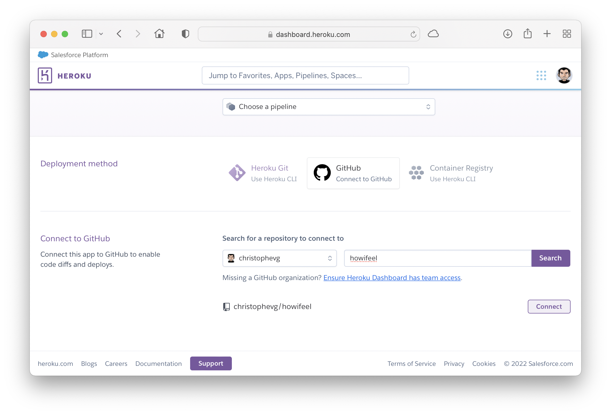

# How I Feel

> a small 1-hour project to show newbe developers what coding is all about

## Rationale

Starting in today's world of development of software can be daunting. Especially because the beginnings are so far apart from what we've come acustomed to when using that same software. Starting with "hello world" seems so utterly uninteresting that it takes a big effort to get past those first few days, before one reaches the level that something semi-useful can be created.

This repository is an experiment to start from a completely blanc directory and end up with an actual, useable piece of software. Each commit is a step in this experiment, described in the paragraphs below. The goal is _not_ to learn every step by heart, but to go through the entire process of conceiving and actually implementing a small real-world application. A way to get a realistic overview of what lies at the end of that first long stretch of new knowledge.

## Prerequisites

The following tools are needed and might first need some installation or creation of an account.

* A unix-like environment, say MacOS, Linux,... Why? Because that's what I use. You migth get away with Windows. I won't be here to help, sorry :-( A unix-like environment comes with a terminal, which allows you to give commands to the system. On MacOS, the Terminal application looks like this: 
* An editor, something to write code with. Here personal flavour kicks in. I like [TextMate](https://macromates.com), you might like something else. Please, don't hurt yourself, don't like [notepad](https://en.wikipedia.org/wiki/Windows_Notepad).
* [git](https://git-scm.com/book/en/v2/Getting-Started-Installing-Git)
* A [GitHub account](https://github.com/join)
* [python](https://www.python.org/downloads/)
* [pyenv](https://christophe.vg/technology/Pyenv-Notes) - I refer to my own installation instruction page. You can also consult [the official pyenv documentation](https://github.com/pyenv/pyenv), which is also hosted on GitHub.
* A [Heroku account](https://signup.heroku.com)
* [MongoDB](https://docs.mongodb.com/manual/installation/)

## The Goal

We want to make a little web application that allows a user to log in and set his/her current mood - expressed as red, yellow or green.

Besides that, the user can create unique links to distribute to others, that can use that link to consult the user's mood. Those links can be deleted, removing access to certain users.

## 19:21 - git init, README.md, git push

Open up a terminal, create a directory to work in and initialize your git repository. Git repository? Git is a tool that allows you to keep track of your code as you write it.

```zsh
xtof@sokudo Workspace % mkdir howifeel
xtof@sokudo Workspace % cd howifeel
xtof@sokudo howifeel % git init
Initialized empty Git repository in /Users/xtof/Workspace/howifeel/.git/
xtof@sokudo howifeel % 
```

Because this repository contains both the application, aswell as the supporting story about writing it, I started with a first file: `README.md`, the very one you're reading right now. It's good practice to document your code, so I advise you to also always write one. It won't contain al the details of this one, but should at least include some basic information about how to install and run your application and how to contact you in case there is a problem.

In this case, you can contact _me_ through [GitHub Discussions](https://github.com/christophevg/howifeel/discussions/1) ;-)

Now time to fire up a few other git commands:

```zsh
xtof@sokudo howifeel % git add README.md
xtof@sokudo howifeel % git commit -m "repo init with README"
[master (root-commit) 93c438d] repo init with README
 1 files changed, 78 insertions(+)
 create mode 100644 README.md
```

This adds our current changes (the README file) to the "git repository" and marks it as a committed sert of changes, along with a small message that explains what this "commit" is all about.

The `.md` extension to the README file tells us that it is written in "MarkDown". This is a small, simple, text-oriented markup/layout language that is pretty convenient to write this kind of documentation. Take a look at [the code](https://github.com/christophevg/howifeel/blob/master/README.md?plain=1) that was converted into this visualisation when viewed on GitHub. 

Now, we're not done yet. We not only want to track our changes, we also want them to be safe in a place where we can share them. Enter GitHub. Head over to a browser, login to your github account and create a new "repository", let's say `howifeel`.

After creating the repository in GitHub, we add a reference to it in our own local git repository and "push" our changes to it.

```zsh
xtof@sokudo howifeel % git remote add github git@github.com:christophevg/howifeel.git
xtof@sokudo howifeel % git push -u github master
Enumerating objects: 5, done.
Counting objects: 100% (5/5), done.
Delta compression using up to 10 threads
Compressing objects: 100% (4/4), done.
Writing objects: 100% (5/5), 296.27 KiB | 3.25 MiB/s, done.
Total 5 (delta 0), reused 0 (delta 0), pack-reused 0
To github.com:christophevg/howifeel.git
 * [new branch]      master -> master
Branch 'master' set up to track remote branch 'master' from 'github'.
```

Now refresh the page on GitHub and behold, your first commit is online...


Yeah!

## 19:30 - Now What do we Need to Build?

Let's reiterate our "requirements":

* a web application
* users
* update mood indicator
* create unique links
* delete unique links

### A Web Application

Everything is happening online. Of course we want our application to be online. The easiest way to get something online it through the World Wide Web (WWW), which is brought to you by your browser. 

Web applications, running in a browser are created (mainly) using HTML, the Hyper Text Markup Language... after Markdown, the second markup language we encounter and will use to create "pages" for our application.

At this point you have already been using several web applications. If not before today, you have created several accounts as part of the prerequisites.

### Users

Which brings us to "users". Just like GitHub, Heroku,... and so many other web applications, we want our users to be able to create an account to ...

###  Update Mood Indicator

... update their mood and ...

### Create Unique Links

... create unique links, which can be shared with other people.

### Delete Unique Links

And sometimes we want to those people to no longer "follow us", so we want our users to be able to remove access for those people, by deleting the unique link that was created for them.

### Pages

Let's take 5 steps back: a web application consists of pages. Each page provides a certain functionality. Let's make a list of pages we will need for our application. Think back of your experience with GitHub and Heroku, or Instagram, SnapChat,...

1. frontpage
2. sign up page
3. personal mood update page
4. manage unique links page

### An API

The web application is merely what runs in your browser. This isn't enough to be able to intertact with your followers. Their browsers won't connect directly to your browser. There is a "hidden" part in between: the server. A server does what its name says: it serves your web application to all interested parties: you, your followers,...

First of all it serves your pages to the browser. Second, it will process commands that you give using the application in your browser - let's say that I set my mood to "green", keep that mood somewhere safe and provide it to my followers when they in their turn consult the server.

This second part, the processing of commands by the server, is implemented in what is called a Application Programming Interface (API). It's an interface (something you can interact with) that allowd applications (like our web application) to use the server in a programming way. Think of it as a set of commands you can give to the server, for example:

1. show me the frontpage
2. show me the signup page
3. create an account with my information
4. show me my personal mood page
5. update my personal mood
6. show me my unique links management page
7. create a new unique link
8. delete a unique link

So, you can see there are basically two types of commands: 1) show me a page and 2) change (create/update/delete) some information.

### A Database

The server needs to store the information about me and my followers. To do this it needs another server: a database server. In this case we will be using MongoDB. There are many other possibilities. Given for this project, it is the easiest to get started with and doesn't require a lot of background knowledge. You'll thank me for choosing it.

And that's it. We have our web application, consisting of 4 pages, an API with 8 commands and a database server.

Let's start writing code...

But first, we commit this step, because small commits make a happy developer:

```zsh
xtof@sokudo howifeel % git add README.md 
xtof@sokudo howifeel % git commit -m "what do we need to build?"
[master 4a00af7] what do we need to build?
 1 file changed, 71 insertions(+)
xtof@sokudo howifeel % git push
Enumerating objects: 5, done.
Counting objects: 100% (5/5), done.
Delta compression using up to 10 threads
Compressing objects: 100% (3/3), done.
Writing objects: 100% (3/3), 1.94 KiB | 1.94 MiB/s, done.
Total 3 (delta 1), reused 0 (delta 0), pack-reused 0
remote: Resolving deltas: 100% (1/1), completed with 1 local object.
To github.com:christophevg/howifeel.git
   2386f56..4a00af7  master -> master
```

## 19:35 - Hello Bootstrap

Stand on the shoulder of giants. It must be your credo when entering the world of code. Choosing the right tools for the job not only consist of a suitable programming language (yes, there is more than one and one doesn't fit all problems), it also means using existing components, modules, packages, frameworks,...

In this case we are going to leverage the wonderful work initiated by Twitter called [Bootstrap](https://getbootstrap.com). Bootstrap is a collection of HTML and related styling that upgrades your HTML experience to a whole new level. In stead of having to codify every little thing, you can simple think in terms of banners, buttons, etc, up to entire ready-made pages. Take a look at some [examples](https://getbootstrap.com/docs/5.1/examples/) a you'll probably notice a few pages we will happily reuse.

But first take a peek at [the bootstrap starter template](https://getbootstrap.com/docs/5.1/getting-started/introduction/#starter-template):

```html
<!doctype html>
<html lang="en">
  <head>
    <!-- Required meta tags -->
    <meta charset="utf-8">
    <meta name="viewport" content="width=device-width, initial-scale=1">

    <!-- Bootstrap CSS -->
    <link href="https://cdn.jsdelivr.net/npm/bootstrap@5.1.3/dist/css/bootstrap.min.css" rel="stylesheet" integrity="sha384-1BmE4kWBq78iYhFldvKuhfTAU6auU8tT94WrHftjDbrCEXSU1oBoqyl2QvZ6jIW3" crossorigin="anonymous">

    <title>Hello, world!</title>
  </head>
  <body>
    <h1>Hello, world!</h1>

    <script src="https://cdn.jsdelivr.net/npm/bootstrap@5.1.3/dist/js/bootstrap.bundle.min.js" integrity="sha384-ka7Sk0Gln4gmtz2MlQnikT1wXgYsOg+OMhuP+IlRH9sENBO0LRn5q+8nbTov4+1p" crossorigin="anonymous"></script>
  </body>
</html>
```
Meet HTML. It consists of "tag"-pairs such as `<html>...</html>` and `<h1>...</h1>` that enclose their content and give meaning to it, e.g. `<h1>` marks up a header of the highest level, think of it as your main title.

There is in fact just a single line in those 15 lines that is really important: `<h1>Hello, world!</h1>`. All other lines are technical mumbojumbo. Save these lines to a file, say `index.html` in a new directory structure, say `src/pages`:

```zsh
xtof@sokudo howifeel % mkdir -p src/pages
```

... and open the file in a browser:


And of course ...

```zsh
xtof@sokudo howifeel % git add README.md 
xtof@sokudo howifeel % git commit -m "introducing bootstrap and say hello"
[master ccac37b] introducing bootstrap and say hello
 2 files changed, 41 insertions(+)
xtof@sokudo howifeel % git push 
Enumerating objects: 5, done.
Counting objects: 100% (5/5), done.
Delta compression using up to 10 threads
Compressing objects: 100% (3/3), done.
Writing objects: 100% (3/3), 1.60 KiB | 1.60 MiB/s, done.
Total 3 (delta 1), reused 0 (delta 0), pack-reused 0
remote: Resolving deltas: 100% (1/1), completed with 1 local object.
To github.com:christophevg/howifeel.git
   53d98d2..ccac37b  master -> master
```

## 19:46 - Whoops

Darn, I've made a few mistakes while writing this README: the code sections shouldn't be marked as "zsh" but "zsh", a few links are incoreectly formatted and I made a typo in the last screenshot. Let's edit those and add those changes to our repository.

Before we commit our changes, git allows us to inspect what we have changed:

```zsh
On branch master
Your branch is up to date with 'github/master'.

Changes not staged for commit:
  (use "git add <file>..." to update what will be committed)
  (use "git restore <file>..." to discard changes in working directory)
	modified:   README.md

no changes added to commit (use "git add" and/or "git commit -a")
```

Git also allows us to see what we actually changed. You can use the command git diff` for that, though it tends to be a bit harsh on the eye at the beginning. If you install a more graphical tool, like [GitHub Desktop](https://docs.github.com/en/desktop/installing-and-configuring-github-desktop/installing-and-authenticating-to-github-desktop/installing-github-desktop) things become much nicer to look at:


And ...

```zsh
xtof@sokudo howifeel % git add README.md 
xtof@sokudo howifeel % git commit -m "fixing some mistakes"
[master 42bcc08] fixing some mistakes
 1 file changed, 32 insertions(+), 10 deletions(-)
xtof@sokudo howifeel % git push
Enumerating objects: 5, done.
Counting objects: 100% (5/5), done.
Delta compression using up to 10 threads
Compressing objects: 100% (3/3), done.
Writing objects: 100% (3/3), 1.07 KiB | 1.07 MiB/s, done.
Total 3 (delta 1), reused 0 (delta 0), pack-reused 0
remote: Resolving deltas: 100% (1/1), completed with 1 local object.
To github.com:christophevg/howifeel.git
```

Our changes are now also viewable [on GitHub](https://github.com/christophevg/howifeel/commit/42bcc088b551b0bceb26dbc25de472948a8f3e78?diff=split), ready to be inspected by anyone interested in our code:


## 19:51 - Meet Python

Before we cruise on let's take 5 minutes to setup our coding environment. We'll be using the programming language called [Python](https://www.python.org/). I personally got into python roughly 10 years ago during my [renewed studying experience/experiment](https://christophe.vg/about/Revisiting_Higher_Education).

And I have never looked back ;-) Python is a wonderful, versatile, non-nonse language that allows you to quickly write something without too much fuzz, and just as well is allows you to construct beautifully structured larger code bases. One of the great things about Python is its vast and high-quality collection of modules. We'll see some of those as we move forward. Remember our "standing on the shoulders of giants" credo? The Python community really excells at this.

Another good practice you should adopt is to use "virtual environments". Virtual environments allow you to seemingly operate in a world solely dedicated to your single application. You can install Python modules, without interfering with other application on you machine. You could even use different Python versions. To manage such a virtual environment, I like to use "pyenv". Two commands create the virtual environment and activate it for this directory. It will even be re-activated everytime we enter this directory, based on the `.python-version` file, and our shell shows this by prefixing our prompt with the name of the virtual environment.

```zsh
xtof@sokudo howifeel % pyenv virtualenv howifeel
Looking in links: /var/folders/nq/xvzwtwsj25727ybthkp1wmhr0000gn/T/tmp8blbswbs
Requirement already satisfied: setuptools in /Users/xtof/.pyenv/versions/3.8.12/envs/howifeel/lib/python3.8/site-packages (56.0.0)
Requirement already satisfied: pip in /Users/xtof/.pyenv/versions/3.8.12/envs/howifeel/lib/python3.8/site-packages (21.1.1)
xtof@sokudo howifeel % pyenv local howifeel
(howifeel) xtof@sokudo howifeel % cat .python-version 
howifeel
```

Everything we do from now on, will only be executed and applied within the scope of this virtual environment. If we're ever done with it, we can even just throw it away without any garbage to clean up.

Python can be used using the `python` application, which can be given a file with python code in it, or you can just start it and feed it one command at a time. So you can do this:

```zsh
(howifeel) xtof@sokudo howifeel % python
Python 3.8.12 (default, Nov  6 2021, 10:34:02) 
[Clang 13.0.0 (clang-1300.0.29.3)] on darwin
Type "help", "copyright", "credits" or "license" for more information.
>>> print("Hello World")
Hello World
>>> 
```

.. or you can create a file and execute that:

```zsh
(howifeel) xtof@sokudo howifeel % echo 'print("Hello World")' > hello.py
(howifeel) xtof@sokudo howifeel % cat hello.py 
print("Hello World")
(howifeel) xtof@sokudo howifeel % python hello.py 
Hello World
```

The former really comes in handy to quickly test something before creating your actual code files.

And you know the drill..

```zsh
(howifeel) xtof@sokudo howifeel % git status
On branch master
Your branch is up to date with 'github/master'.

Changes not staged for commit:
  (use "git add <file>..." to update what will be committed)
  (use "git restore <file>..." to discard changes in working directory)
	modified:   README.md

Untracked files:
  (use "git add <file>..." to include in what will be committed)
	.python-version
	hello.py

no changes added to commit (use "git add" and/or "git commit -a")
(howifeel) xtof@sokudo howifeel % rm hello.py
(howifeel) xtof@sokudo howifeel % echo ".python-version" >> .gitignore
(howifeel) xtof@sokudo howifeel % git status
On branch master
Your branch is up to date with 'github/master'.

Changes not staged for commit:
  (use "git add <file>..." to update what will be committed)
  (use "git restore <file>..." to discard changes in working directory)
	modified:   README.md

Untracked files:
  (use "git add <file>..." to include in what will be committed)
	.gitignore

no changes added to commit (use "git add" and/or "git commit -a")
(howifeel) xtof@sokudo howifeel % git add .gitignore 
(howifeel) xtof@sokudo howifeel % git add README.md 
(howifeel) xtof@sokudo howifeel % git commit -m "introducing python and virtual environments"
[master bbfc043] introducing python and virtual environments
 2 files changed, 52 insertions(+)
 create mode 100644 .gitignore
(howifeel) xtof@sokudo howifeel % git push
Enumerating objects: 6, done.
Counting objects: 100% (6/6), done.
Delta compression using up to 10 threads
Compressing objects: 100% (3/3), done.
Writing objects: 100% (4/4), 2.13 KiB | 2.13 MiB/s, done.
Total 4 (delta 1), reused 0 (delta 0), pack-reused 0
remote: Resolving deltas: 100% (1/1), completed with 1 local object.
To github.com:christophevg/howifeel.git
   98d8d72..bbfc043  master -> master
```

Before adding and committing, I inspected the changes. The `hello.py` test file can be removed, and what about the `.python-version` file? Well, it can't be removed, and it shouldn't be part of the repository, since someone else might call the environment differently, or even use another environment manager (yes there are more ;-)). So we tell git to ignore it.

## 19:54 - Time to Serve

With python up and running in a virtual environment, it's time bring things more in line with out goal. Our "Hello World" page is currently just a file on our own machine, in our own repository and also [on GitHub](https://github.com/christophevg/howifeel/blob/master/src/pages/index.html). In its current form, it won't be accessible by our users and their followers. As said before, we need a server component. Let's introduce that now.

First we install `flask` and `gunicorn`, two python packages. The former is a framework for creating web applications, more specifically, the server side. The latter is a framework to actually serve the web application. You could do without, since flask can be run simply using python. Using gunicorn, allows us to work in the same way as Heroku will serve our application. Doing things correct from the beginning is always a good idea.

To install python packages we use the Package Installer for Python, short `pip`:

```zsh
(howifeel) xtof@sokudo howifeel % pip install flask
Collecting flask
  Using cached Flask-2.0.2-py3-none-any.whl (95 kB)
Collecting click>=7.1.2
  Using cached click-8.0.3-py3-none-any.whl (97 kB)
Collecting Jinja2>=3.0
  Downloading Jinja2-3.0.3-py3-none-any.whl (133 kB)
     |████████████████████████████████| 133 kB 2.8 MB/s 
Collecting itsdangerous>=2.0
  Using cached itsdangerous-2.0.1-py3-none-any.whl (18 kB)
Collecting Werkzeug>=2.0
  Using cached Werkzeug-2.0.2-py3-none-any.whl (288 kB)
Collecting MarkupSafe>=2.0
  Using cached MarkupSafe-2.0.1-cp38-cp38-macosx_10_9_universal2.whl (18 kB)
Installing collected packages: MarkupSafe, Werkzeug, Jinja2, itsdangerous, click, flask
Successfully installed Jinja2-3.0.3 MarkupSafe-2.0.1 Werkzeug-2.0.2 click-8.0.3 flask-2.0.2 itsdangerous-2.0.1
WARNING: You are using pip version 21.1.1; however, version 22.0 is available.
You should consider upgrading via the '/Users/xtof/.pyenv/versions/3.8.12/envs/howifeel/bin/python3.8 -m pip install --upgrade pip' command.
(howifeel) xtof@sokudo howifeel % pip install --upgrade pip
Requirement already satisfied: pip in /Users/xtof/.pyenv/versions/3.8.12/envs/howifeel/lib/python3.8/site-packages (21.1.1)
Collecting pip
  Downloading pip-22.0-py3-none-any.whl (2.1 MB)
     |████████████████████████████████| 2.1 MB 2.5 MB/s 
Installing collected packages: pip
  Attempting uninstall: pip
    Found existing installation: pip 21.1.1
    Uninstalling pip-21.1.1:
      Successfully uninstalled pip-21.1.1
Successfully installed pip-22.0
(howifeel) xtof@sokudo howifeel % pip install gunicorn
Collecting gunicorn
  Using cached gunicorn-20.1.0-py3-none-any.whl (79 kB)
Requirement already satisfied: setuptools>=3.0 in /Users/xtof/.pyenv/versions/3.8.12/envs/howifeel/lib/python3.8/site-packages (from gunicorn) (56.0.0)
Installing collected packages: gunicorn
Successfully installed gunicorn-20.1.0
```

Remark that pip tells us that our version of pip is outdated and nicely tells us how to upgrade it.

Time to create our first "server". Create a file `server.py`:

```python
import os
from flask import Flask, render_template

template_dir = os.path.abspath("src/pages")
app = Flask(__name__, template_folder=template_dir)

@app.route("/")
def hello():
  return render_template('index.html')
```

and run it ...

```zsh
(howifeel) xtof@sokudo howifeel % gunicorn server:app
[2022-01-30 19:30:11 +0100] [93015] [INFO] Starting gunicorn 20.1.0
[2022-01-30 19:30:11 +0100] [93015] [INFO] Listening at: http://127.0.0.1:8000 (93015)
[2022-01-30 19:30:11 +0100] [93015] [INFO] Using worker: sync
[2022-01-30 19:30:11 +0100] [93032] [INFO] Booting worker with pid: 93032
```

and visit [http://localhost:8000](http://localhost:8000) ...


Et voila ... you have created your first web application, with one page and a server component with an API that serves that one page. If you go back and look at what we wanted to achieve, we now have an embryonal version of what we need up and running. Except...

But first:

```zsh
(howifeel) xtof@sokudo howifeel % git status
On branch master
Your branch is up to date with 'github/master'.

Changes not staged for commit:
  (use "git add <file>..." to update what will be committed)
  (use "git restore <file>..." to discard changes in working directory)
	modified:   README.md

Untracked files:
  (use "git add <file>..." to include in what will be committed)
	__pycache__/
	server.py

no changes added to commit (use "git add" and/or "git commit -a")
(howifeel) xtof@sokudo howifeel % echo "__pycache__" >> .gitignore
(howifeel) xtof@sokudo howifeel % git add .gitignore
(howifeel) xtof@sokudo howifeel % git add server.py
(howifeel) xtof@sokudo howifeel % git add README.md 
(howifeel) xtof@sokudo howifeel % git commit -m "enter the server"
[master 0a1807b] enter the server
 3 files changed, 81 insertions(+)
 create mode 100644 server.py
(howifeel) xtof@sokudo howifeel % git push
Enumerating objects: 11, done.
Counting objects: 100% (11/11), done.
Delta compression using up to 10 threads
Compressing objects: 100% (6/6), done.
Writing objects: 100% (7/7), 523.95 KiB | 4.90 MiB/s, done.
Total 7 (delta 2), reused 0 (delta 0), pack-reused 0
remote: Resolving deltas: 100% (2/2), completed with 2 local objects.
To github.com:christophevg/howifeel.git
   c13bae6..0a1807b  master -> master
```

## 20:01 - Go Online

Our web application is currently running on our machine. No one but us can access `http://localhost:8000`. If we want people to be able to use it, we need to get it online. Yes, it's available on GitHub, but GitHub won't "serve" it. To do that, we resort to Heroku, a Cloud service provider, that is so kind to offer a free tier for small projects.

Head over to Heroku and create an application, connect it to our GitHub repository and enable automatic deploys every time we push our changes to GitHub:





Now we only have to add two more files, to tell Heroku how to actually serve our application, a file called `Procfile` (yes without any extension):

```
web: gunicorn server:app
```

And the list of python packages we are using:

```zsh
(howifeel) xtof@sokudo howifeel % pip freeze
click==8.0.3
Flask==2.0.2
gunicorn==20.1.0
itsdangerous==2.0.1
Jinja2==3.0.3
MarkupSafe==2.0.1
Werkzeug==2.0.2
(howifeel) xtof@sokudo howifeel % pip freeze > requirements.txt
```

Now, are you ready for this ... ?

```zsh
(howifeel) xtof@sokudo howifeel % git status
On branch master
Your branch is up to date with 'github/master'.

Changes not staged for commit:
  (use "git add <file>..." to update what will be committed)
  (use "git restore <file>..." to discard changes in working directory)
	modified:   README.md

Untracked files:
  (use "git add <file>..." to include in what will be committed)
	Procfile
  requirements.txt

no changes added to commit (use "git add" and/or "git commit -a")
(howifeel) xtof@sokudo howifeel % git add README.md Procfile requirements.txt
(howifeel) xtof@sokudo howifeel % git commit -m "let Heroku serve it"    
[master 1442edf] let Heroku serve it
 3 files changed, 21 insertions(+)
 create mode 100644 Procfile
 create mode 100644 requirements.txt
(howifeel) xtof@sokudo howifeel % git push
Enumerating objects: 6, done.
Counting objects: 100% (6/6), done.
Delta compression using up to 10 threads
Compressing objects: 100% (3/3), done.
Writing objects: 100% (4/4), 995 bytes | 995.00 KiB/s, done.
Total 4 (delta 1), reused 0 (delta 0), pack-reused 0
remote: Resolving deltas: 100% (1/1), completed with 1 local object.
To github.com:christophevg/howifeel.git
   c06b3ea..1442edf  master -> master
```

Now take a look at your Heroku overview page for your application:


And take a look at the deployment progress...


Wait ... is that ... a public URL there? Yes it is ... yes it is ...


You first web application is now online and every commit you push to GitHub will be automatically deployed on Heroku, available for everybody to use.

Take a minute to reflect, because this is an important moment. You now have a complete end-to-end setup for serving a web application. From now on, the focus can be on the actual application, you infrastructure is up and running.

## 20:05 - Constructing our Actual Application

Let's replace the dummy "Hello World" page with some actual pages. Here we can take several approaches: we could start with a front page and a sign-up page, actually following the typical user journey. Our we could start with creating just the "mood update" page, and see how this gets into our database.

I typically prefer to start with the core functionality, that what it's all about: "recording my mood". Expanding it to multiple users can come later. Let's make this first a single-user application (and we keep the multiple users in mind in the meantime ;-))

### Designing our Page

Let's browse once again throuhg the [Bootstrap examples](https://getbootstrap.com/docs/5.1/examples/). The [pricing example](https://getbootstrap.com/docs/5.1/examples/pricing/) seems like a good starting point for presenting and recording my mood. Let's take its source code and dependencies and create a new page `[src/pages/mood.html](src/pages/mood.html)`. It's a bit large to include here, so look at the file and see that I've stripped out some things and modified it to our needs. I've done this in several commits, so in the history of the repository, you can now see what changes I made to modify the original example.

The example has an additional file dependency: `pricing.css` - I've renamed it to `mood.css`, for obvious reasons. A CSS, or Cascading Style Sheet, defines how HTML elements will be styled. It separated structure from style, which is a good thing, trust me ;-)

CSS files are static files, they don't change. So Flask treaths them as such. We just need to let it know where to find them. Besides that, we also introduce our second API call, the one to get the page to manage our mood. The relevant additions/changes are:

```python
# ...

template_dir = os.path.abspath("src/pages")
static_dir   = os.path.abspath("src/static")
app = Flask(__name__, template_folder=template_dir, static_folder=static_dir)

# ...

@app.route("/mood")
def mood():
  return render_template('mood.html')
```

Fire up gunicorn again, and take a look at [http://localhost:8000/mood](http://localhost:8000/mood):


It's bare bones, it's clear, just the way I like it ;-) Thank you Bootstrap. Now resize your browser a bit...

Bootstrap is a responsive framework, which means that it nicely reformats your HTML structure even to accomodate almost all screen sizes. So your application is iPhone ready, without any action from our part. Talk about giant shoulders.


### Activating our Page

If you click on the buttons, nothing happens right now. And that's how it should be. HTML is a markup language for structuring web documents. It's not a programming language that allows us to do things with the HTML elements. To do that we need to introduce another very important language in today's development world: Javascript.

> Why not Python? Good question. Simply because when browsers were born, around 1995, Javascript was introduced and Python was on a different trajectory. Too bad, how nice would it have been to have [Python in a Browser](https://brython.info) ;-)

Just like packages and modules augment the quality of Python, Javascript also has its upgrade: JQuery, a set of Javascript functionality to make working with both Javascript and HTML pages a lot easier.

